# Welcome

Hello!! This is Abir Abdullha. I have a couple of years of experience in data science, machine learning, deep learning and project management. I am hard-working, professional, and highly motivated. Always excited for more experience and knowledge. Feel free to explore my portfolio and get in touch to discuss how we can work together!

#### Technical Skills: Machine Learning, Data Science, Researcher, Data Visualization Tool, Deep Learning, Client Management, Python, Business Analyst, DBMS, E-commerce, Project Management

## Education
- B.Sc., CSE | Daffodil International University | 3.03 (_2020_)						       		
- H.S.C, Science	| BAF Shaheen College, Dhaka | 4.50 (_2015_)	 			        		
- S.S.C, Science | Mirpur Bangla High School And College | 4.56 (_2013_)

## Work Experience
**Data Science Reseacher & AI Tutor at Toloka (_March 2024 - Present_)**
- Research on different types of topics based on Machine learning, Deep learning, NLP and Big data.
- Need to train LLM model for the automated generated reply.
- Write content on different types of AI topics.
- Research new technology, algorithms, models and library based on AI.

**Project Manager at iSharify Ltd. (_Jan 2022 - Present_)**
- Working as a team leader, Managing different types of projects like data management, product analysis, e-commerce and Customer service.
- Checking all the tasks from the team, setup meetings with the client, and updating all projects to the client.
- Preparing all the plans for the new projects, analysis every project, and trying to resolve every problem in the project.
- I have developed two deep learning models for customer service team and one machine learning model for project management.

**Artificial Intelleigence Instructor at Microland IT solutions LTD. (_July 2022 - December 2022_)**
- Prepared classes and notes regarding AI and researched new technology on AI.
- Worked on AI projects, and took classes to learn about new technologies in AI.

**Data Annotator at Quantigo.ai (_November 2021 - January 2022_)**
- Data cleaning, Data preprocessing, Data annotation, working with Big data.

**Research Assistant at Daffodil International University (_December 2020 - November 2021_)**
- Prepared classes and notes regarding AI, and research on AI.
- Worked on AI projects, took classes, took exams and reported.

**Researcher at DIU ML And NLP Lab (_December 2019 - November 2022_)**
- Research on AI technologies, Worked on NLP, ML and Data Science projects.
- Worked on Data set Speech recognition, worked on data set for Bangla Language.
- Attend different types of Conferences, and presentations on different types of Conferences, and search for the best conferences.
- Publications paper, research on paper, paper writing.

## Other Working Experience

**Founder of IT Crowed (_2019 - 2022_)**
- Full training to work on online, freelancing.
- More than 50 people got earning facilities by working online.
- Guide them proper way to know basic computer skills, training them to develop computer basic skills.
- Graphics design, data entry, surveys, data collection, Machine learning different types of projects were involved where many employees got their chance to work and got payment daily.
- Managed a large number of people and developed a platform where they could earn their skills.

**Founder of Get_project (_2022 - present_)**
- Working on AI technologies, Working on NLP, ML and Data Science projects.
- Research on AI, NLP, ML and Data Science projects, a proper guide to publications of any type of research work.
- Web development projects, AI projects, and Customer service projects.
- Managing different types of projects and managing every team.

**Sales Executive at Pran (_June 2015 - Feb 2016_)**
- Product sell, Product Marketing, Fillup sales target.

**Teacher at Borno Coaching Center (_December 2016 - May 2019_)**
- Took classes, Prepared lessons, took exams, prepared notes, etc.

**Football (_2013- Presents_)**
- Organizing one of the most popular football tournaments in Dhaka (_2016,2018,2023,2024_)
- Played professional football in School, college, Professional, and corporate level.
- Captain in one of the most popular football team in Dhaka Named FC LCBD.

## Projects
### Box detection using Computer Vision
[Project Link](https://github.com/Abir0810/Box_Detection_RANSAC-algorithm)

Box detection using Computer vision. I have used OpenCv and deep learning algorithms. I have also used RANSAC algorithm. 

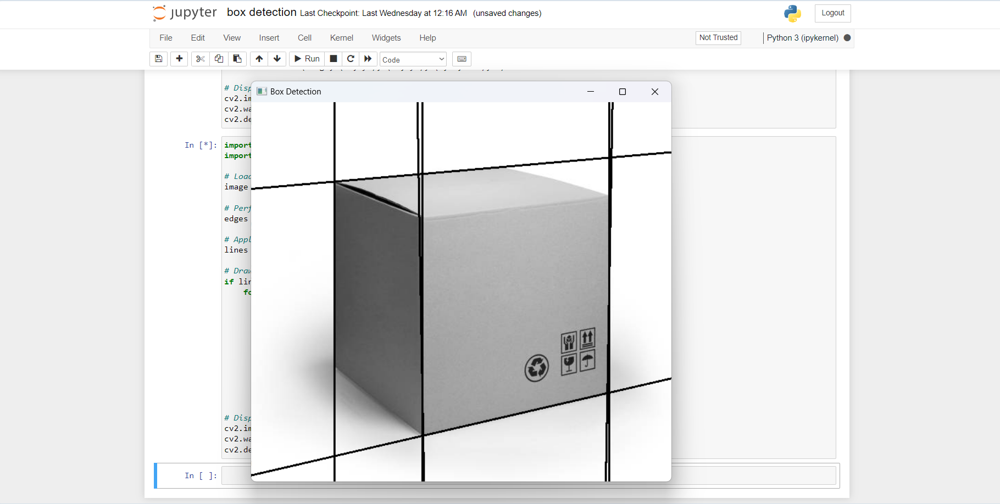

### Upcoming cyber attack prediction using machine learning
[Project Link](https://github.com/Abir0810/Upcoming_cyber_attack_prediction_using_machine_learning)

It analyzes patterns from past cyberattacks using algorithms such as J48, KNN, REPTree, and Random Forest; second, it forecasts future cyberattacks based on those patterns.

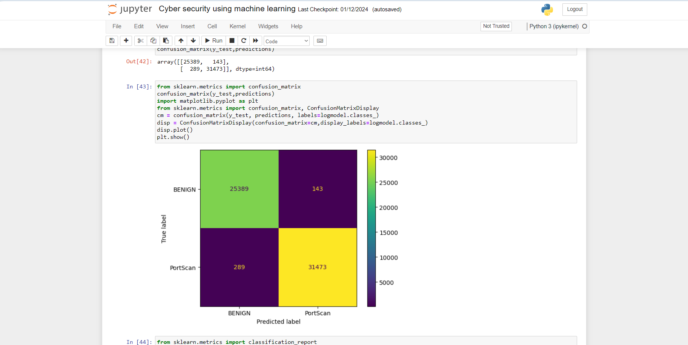

### Sign language prediction using deep learning model
[Project Link](https://github.com/Abir0810/Sign_language_prediction_using_deep_learning_model)

We have trained CNN (Convolutional Neural Network) algorithm to predict sign language. There are also pretrained models which also used in this model.

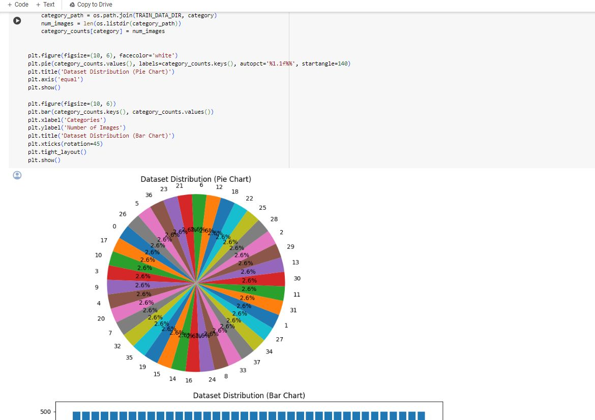

### Apple plant trees disease detection using CNN and Sequential model
[Project Link](https://github.com/Abir0810/apple_trees_plant_dieases_prediction_using_Sequential_model_and_cnn)

Developed a deep learning model using CNN and Sequential model where there are many classifications for Apple plant tress disease. There are a lot of image data. After preprocessing those image data, we have developed a model where the model will identify the disease of the plant. 

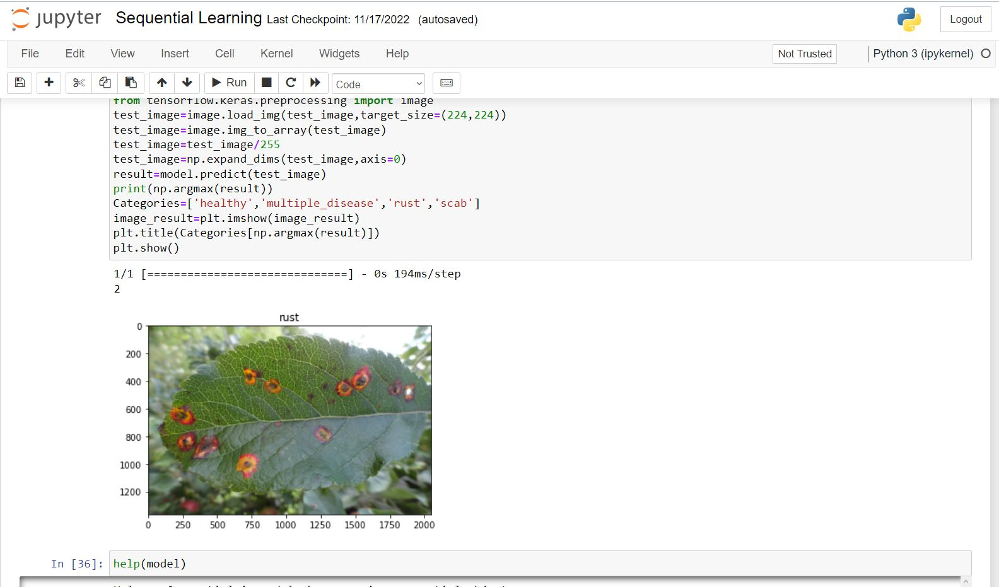

### Cases Prediction using NLP
[Project Link](https://github.com/Abir0810/Customer_cases_prediction_using_NLP)

There are a lot of messages from customer service on e-commerce sites. The data were collected from there. After collecting data, they have trained so that when new cases are generated it will automatically show the response from the customer service manager.

### Chat bot system using NLP
[Project Link](https://github.com/Abir0810/Chatbot_using_NLP)

Automatic AI chatbot where you can train the model and the chatbot will learn from data. The chatbot will give the output in the message.

### Face recognition using deep learning
[Project Link](https://github.com/Abir0810/attendance_system_computer_vision)

The model is used for face recognition where the attendance system will taken automatically and the attendance will be updated on the given file. 

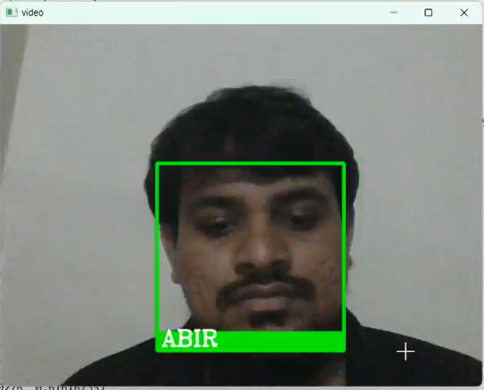

### Virtual mouse using AI
[Project Link](https://github.com/Abir0810/virtual_mouse_using_AI)

By using hand gestures you can make a mouse using AI.

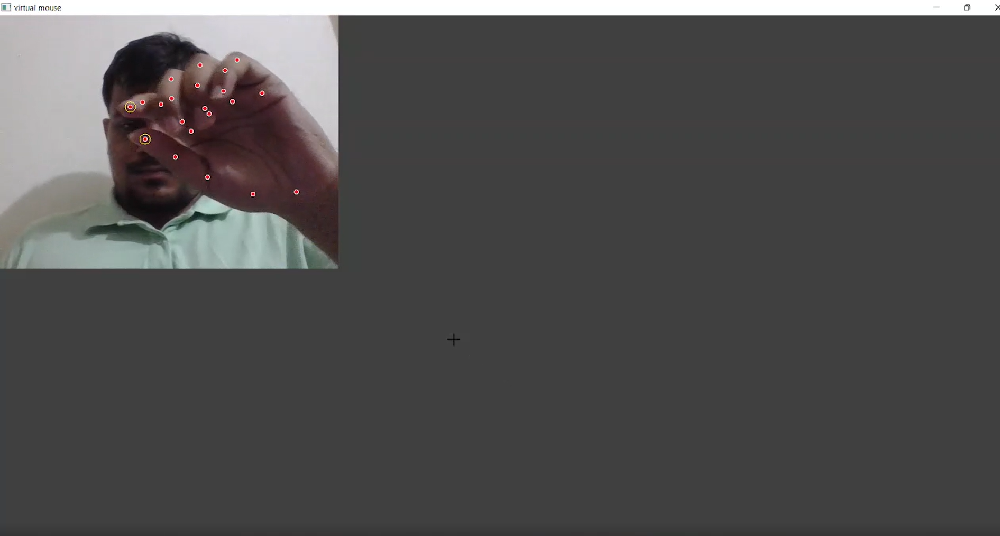

### Human interaction using video data
[Project Link](https://github.com/Abir0810/human_interaction_using_video_data)

Using train data, we can identify which action is taken. The action has different classes. The action will be identified from video data. 

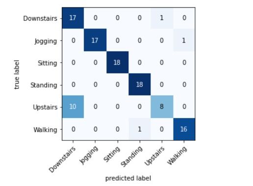

### Drug Addiction prediction using machine learning
[Project Link](Drug_Addiction_prediction_using_machine_learning)

We have analysis their drug addiction behavior. From this research work we can identify drug addiction behavior also. We have used classification model to classified different types of drug addiction people problem.

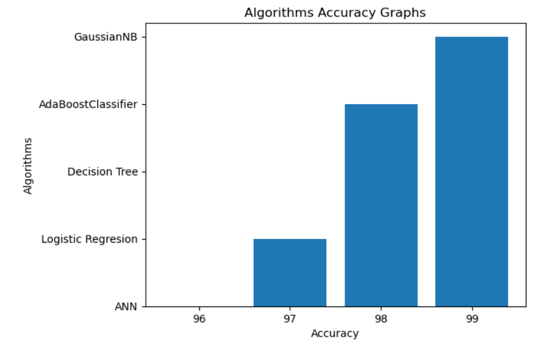

### Acceleramotor data for human action prediction using Machine Learning 
[Project Link](https://github.com/Abir0810/acceleramotor_data_for_human_action)

By using machine learning models the data has been classified. There is accelerator data that has been used to predict the actions.

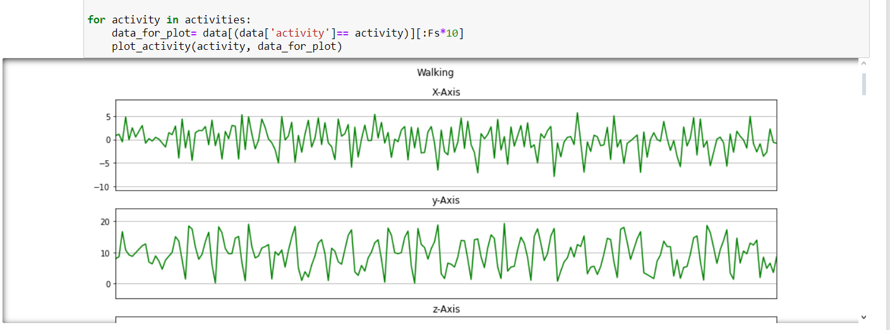

### Firm business prediction model
[Project Link](https://github.com/Abir0810/firm_business_prediction_model)

Visualization of business model. The prediction of risk management using machine learning. So that we can understand and be ready to take business.

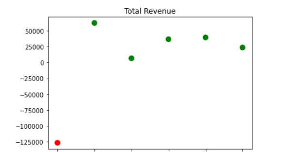

### Toxic comment detection for Bangla language using NLP
[Project Link](https://github.com/Abir0810/toxic_comment_for_bangla_language_NLP)

More than 600000 data have been taken as data. All data has been collected online. There are different classifications to find out the toxicity level and find the sentence is toxic or not. There are visualization and preprocessing of all the trained and test data.

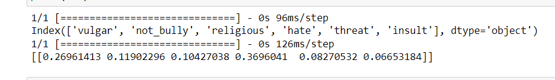

### Brian Tumor disease prediction
[Project Link](https://github.com/Abir0810/brain-tumor-disease-prediction)

2D report data has been taken to find out the disease. CNN model has been trained and there is also part of data preprocessing. There is a hybrid model of CNN and a comparison of each hybrid model.

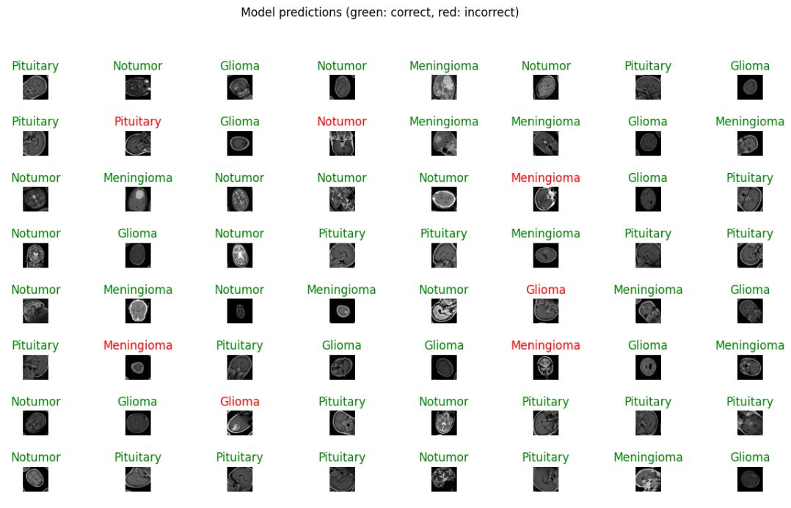

### hberman Survival Data Analysis
[Project Link](https://github.com/Abir0810/hberman_Survival_Data_Analysis)

Predict whether a patient will survive after 5 years or not based upon the patient’s age, his or her operation year and the number of positive lymph nodes.

### Software prediction project using Machine Learning and Deep Learning
[Project Link](https://github.com/Abir0810/hberman_Survival_Data_Analysis)

Software prediction has been used. Where the machine learning and the deep learning algorithms have been compared.

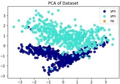

### House price prediction
[Project Link](https://github.com/Abir0810/House_price_prediction)

These are linear regression code .There are linear model,small, medium and large data set solved with linear regression.

### osaka um datamodel using machine learning
[Project Link](https://github.com/Abir0810/osaka_um_datamodel_using_machine_learning)

The model will solve the different problems on um. What is the time and is it possible to grow um in Bangladesh? The model visualizes all the data and makes predictions on these.

### Voice flow demo
[Project Link](https://github.com/Abir0810/Voice_flow_demo)

Automated voice recognitions and answer from the model. Voice assistant. 

## Training, Awards, Mileston And Certifications
- Introduction to data science in python (University of Michigan, Auguest-2020)
- Neural Network and deep learning (DeepLearning.AI, May-2020)
- Python Project: pillow, tesseract, and opencv(University of Michigan, March-2021)
- Coronathon-19
- In recognition of scholarly publications in reputed indexed journals- 2020
- Experience in working more than 40 AI projects so far. 

## Publications
1. Abir Abdullha, AKM Shahriar Azad Rabby, Yeasin Habib, Md. Raisul Islam Masum."Countries Condition Of Forestation And Trees PercentageUsing Machine Learning”,SMART-2019.
2. Abir Abdullha,Sheikh Abujhar."COVID-19: Data Analysis and The situation Prediction Using Machine Learning Based on Bangladesh perspective”,iSAINLP-Aiot-2020.
3. Abir Abdullha,Abdus Sattar,Md Riad Hasan,Md Forhad Hossain." Cultivating Tulip at Extent by Using Machine Learning in Context to Bangladesh”, ICAECT-2022.

## Hobbies

Coding, Research, Traveling, Reading and Football. 

## Photo Gallery

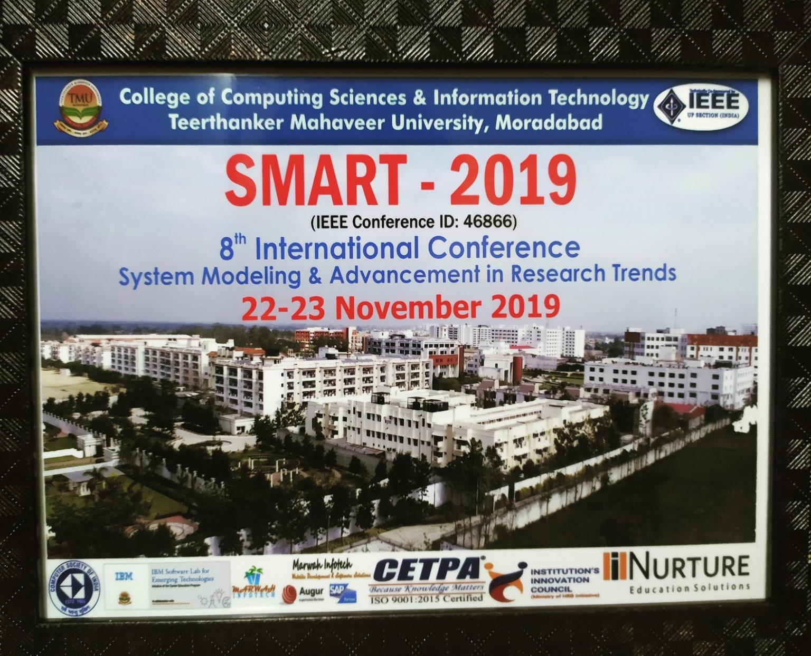

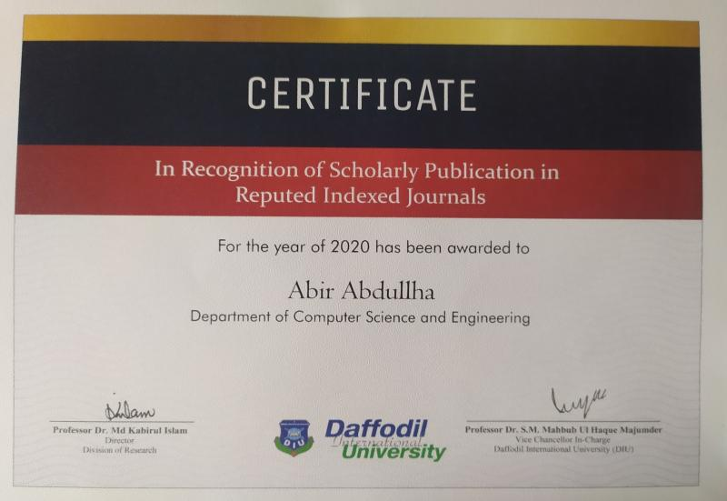
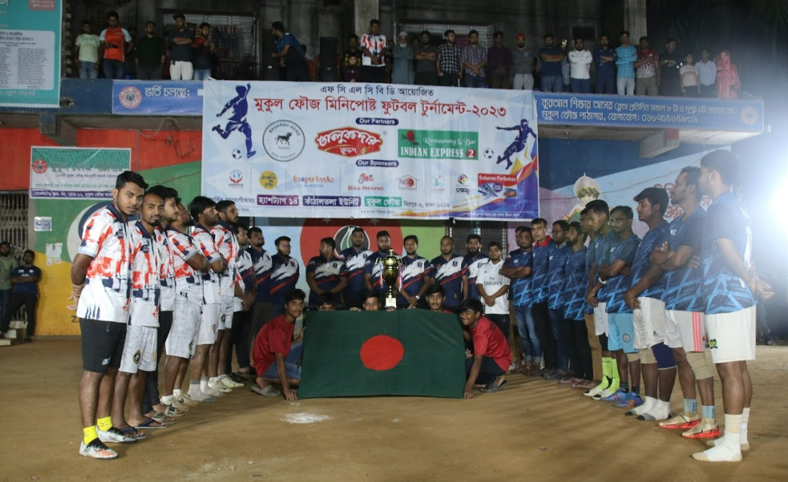
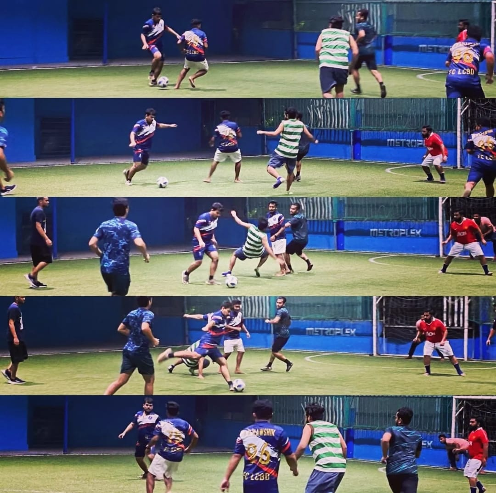
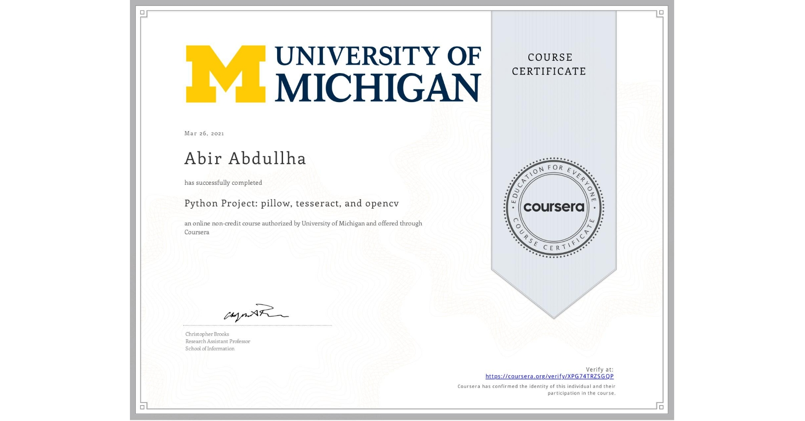
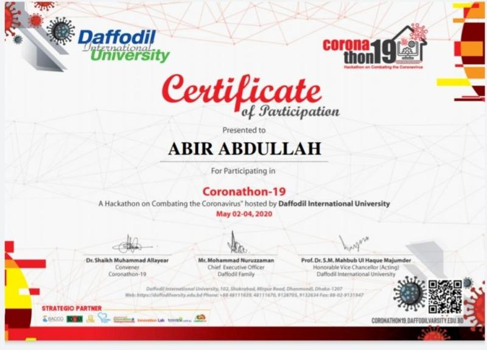

## For Contact

Phone number: +8801682104642

Gmail: abir.abdullah16@gmail.com

Researchgate: https://www.researchgate.net/profile/Abir_Abdullha

[Linkdln](https://www.linkedin.com/in/abir-abdullha-720b7118b/): https://www.linkedin.com/in/abir-abdullha-720b7118b/

[Github](https://github.com/Abir0810): https://github.com/Abir0810

[Google sites](https://sites.google.com/view/abirabdullah/home): https://sites.google.com/view/abirabdullah/home 

[Kaggle](https://www.kaggle.com/abirabdullah): https://www.kaggle.com/abirabdullah
